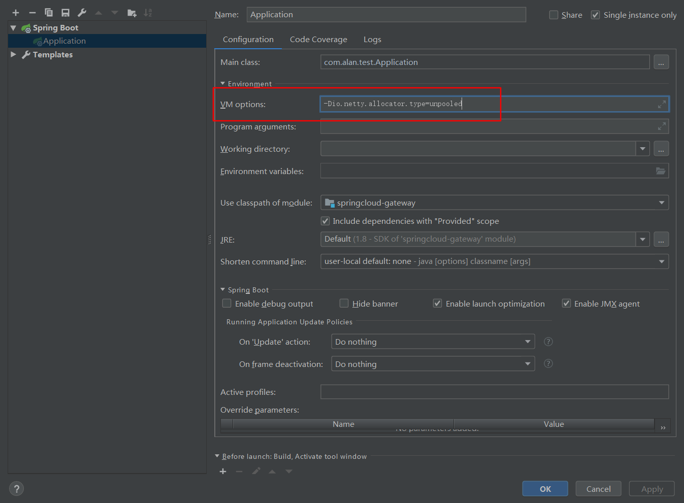
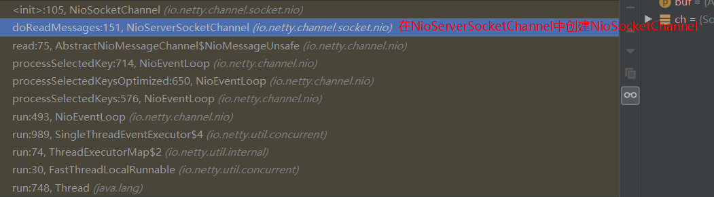
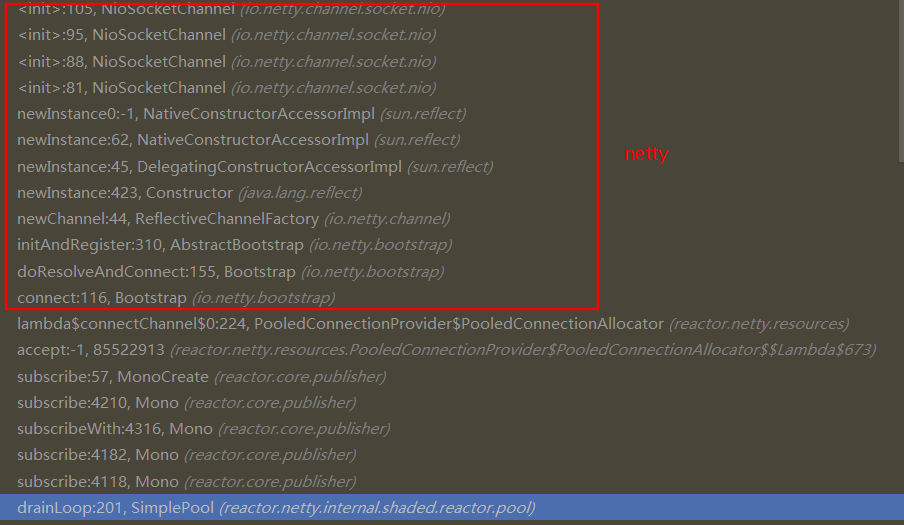
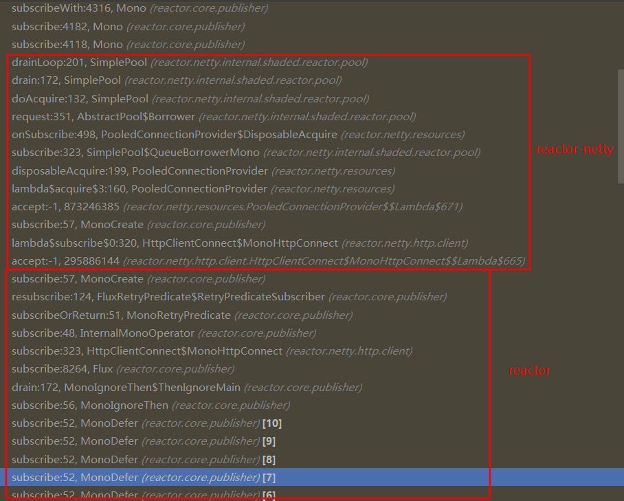
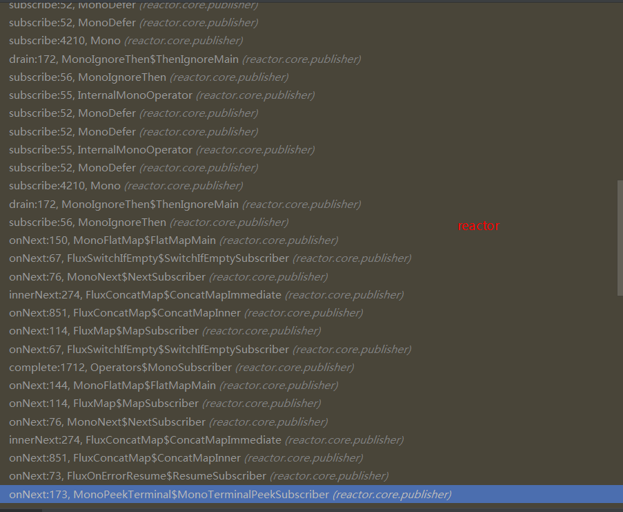
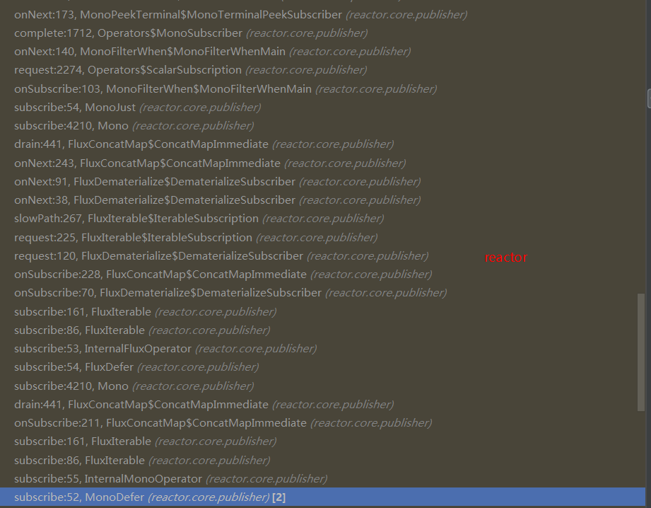
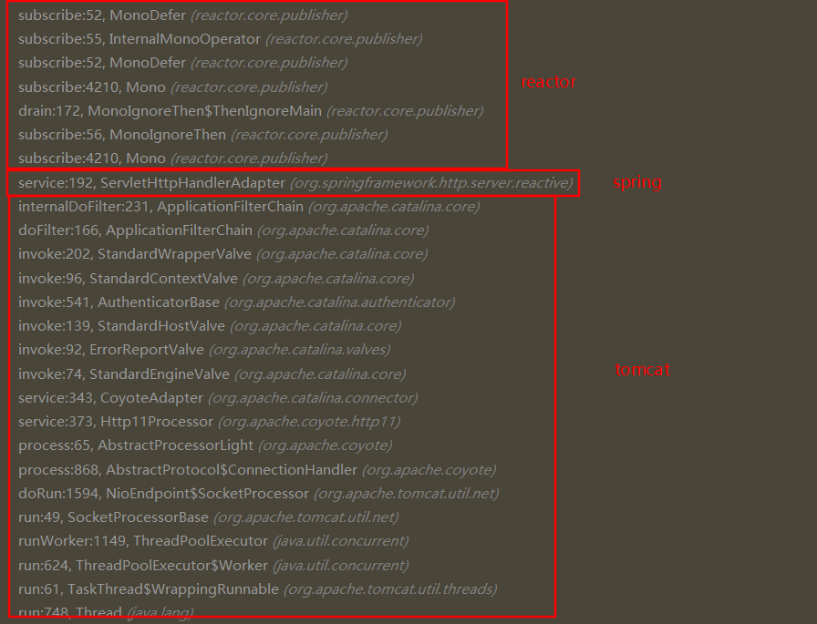

# 故事背景

嘀~嘀~嘀~，生产事故，内存泄漏！

昨天下午，突然收到运维的消息，分部某系统生产环境内存泄漏了，帮忙排查一下。

# 排查过程

## 第一步，要日志

分部给到的异常日志大概是这样（鉴于公司规定禁止截图禁止拍照禁止外传任何信息，下面是我网上找到一张类似的报错）：

```java
LEAK: ByteBuf.release() was not called before it's garbage-collected. See http://netty.io/wiki/reference-counted-objects.html for more information.

Recent access records: 

#1: 
  io.netty.handler.codec.ByteToMessageDecoder.channelRead(ByteToMessageDecoder.java:273)
  io.netty.channel.CombinedChannelDuplexHandler.channelRead(CombinedChannelDuplexHandler.java:253)
  io.netty.channel.AbstractChannelHandlerContext.invokeChannelRead(AbstractChannelHandlerContext.java:362)
  io.netty.channel.AbstractChannelHandlerContext.invokeChannelRead(AbstractChannelHandlerContext.java:348)
	io.netty.channel.AbstractChannelHandlerContext.fireChannelRead(AbstractChannelHandlerContext.java:340)
	io.netty.channel.DefaultChannelPipeline$HeadContext.channelRead(DefaultChannelPipeline.java:1434)
	io.netty.channel.AbstractChannelHandlerContext.invokeChannelRead(AbstractChannelHandlerContext.java:362)
	io.netty.channel.AbstractChannelHandlerContext.invokeChannelRead(AbstractChannelHandlerContext.java:348)
	io.netty.channel.DefaultChannelPipeline.fireChannelRead(DefaultChannelPipeline.java:965)
	io.netty.channel.nio.AbstractNioByteChannel$NioByteUnsafe.read(AbstractNioByteChannel.java:163)
	io.netty.channel.nio.NioEventLoop.processSelectedKey(NioEventLoop.java:646)
	io.netty.channel.nio.NioEventLoop.processSelectedKeysOptimized(NioEventLoop.java:581)
	io.netty.channel.nio.NioEventLoop.processSelectedKeys(NioEventLoop.java:498)
	io.netty.channel.nio.NioEventLoop.run(NioEventLoop.java:460)
	io.netty.util.concurrent.SingleThreadEventExecutor$5.run(SingleThreadEventExecutor.java:884)
	java.lang.Thread.run(Thread.java:748)
```

这一看，不得了了，ByteBuf没有释放，导致内存泄漏了。

## 第二步，看内存指标

既然知道了是内存泄漏，赶紧让运维看下内存使用情况，特别是堆外内存使用情况（因为用了Netty），根据运维反馈，堆内内存使用正常，堆外内存居高不下。

OK，到这里已经可以很明确地断言：堆外内存泄漏了。

> 此时，分两步走，一步是把gateway换成zuul压测观察，一步是内存泄漏问题排查。

## 第三步，要代码

让分部这个项目的负责人把代码给到我，我打开一看，傻眼了，就一个简单的`Spring Cloud Gateway`项目，里面还包含了两个类，一个是AuthFilter用来做权限校验的，一个是XssFilter用来防攻击的。

> Spring Cloud Gateway使用的是Netty，zuul 1.x使用的是Tomcat，本文来源于工纵耗彤哥读源码。

## 第四步，初步怀疑

快速扫一下各个类的代码，在XssFilter里面看到了跟ByteBuf相关的代码，但是，没有明显地ByteBuf没有释放的信息，很简单，先把这个类屏蔽掉，看看还有没有内存泄漏。

但是，怎么检测有没有内存泄漏呢？总不能把这个类删掉，在生产上跑吧。

## 第五步，参数及监控改造

其实，很简单，看过Netty源码的同学，应该比较清楚，Netty默认使用的是`池化的直接内存`实现的ByteBuf，即PooledDirectByteBuf，所以，为了调试，首先，要把池化这个功能关闭。

> 直接内存，即堆外内存。

为什么要关闭池化功能？

因为池化是对内存的一种缓存，它一次分配16M内存且不会立即释放，开启池化后不便观察，除非慢慢调试。

那么，怎么关闭池化功能呢？

在Netty中，所有的ByteBuf都是通过一个叫作`ByteBufAllocator`来创建的，在接口ByteBufAllocator中有一个默认的分配器，找到这个默认的分配器，再找到它创建的地方，就可以看到相关的代码了。

```java
public interface ByteBufAllocator {

    ByteBufAllocator DEFAULT = ByteBufUtil.DEFAULT_ALLOCATOR;
}
public final class ByteBufUtil {

    static final ByteBufAllocator DEFAULT_ALLOCATOR;

    static {
        // 本文来源于工纵耗彤哥读源码
        String allocType = SystemPropertyUtil.get(
                "io.netty.allocator.type", PlatformDependent.isAndroid() ? "unpooled" : "pooled");
        allocType = allocType.toLowerCase(Locale.US).trim();

        ByteBufAllocator alloc;
        if ("unpooled".equals(allocType)) {
            alloc = UnpooledByteBufAllocator.DEFAULT;
            logger.debug("-Dio.netty.allocator.type: {}", allocType);
        } else if ("pooled".equals(allocType)) {
            alloc = PooledByteBufAllocator.DEFAULT;
            logger.debug("-Dio.netty.allocator.type: {}", allocType);
        } else {
            alloc = PooledByteBufAllocator.DEFAULT;
            logger.debug("-Dio.netty.allocator.type: pooled (unknown: {})", allocType);
        }

        DEFAULT_ALLOCATOR = alloc;
    }

}
```

可以看到，是通过`io.netty.allocator.type`这个参数控制的。

OK，在JVM启动参数中添加上这个参数，并把它赋值为`unpooled`。



关闭了池化功能之后，还要能够实时地观测到内存是不是真的有泄漏，这要怎么做呢？

其实，这个也很简单，Netty的`PlatformDependent`这个类会统计所有直接内存的使用。

> 最近一直在研究Netty的源码，所以，我对Netty的各种细节了解地很清楚，本文来源于工纵耗彤哥读源码，最近还在准备，等后面弄完了，开始Netty专栏的创作。

所以，我们只需要写一个定时器，定时地把这个统计信息打印出来就可以了，这里，我就直接给出代码了：

```java
@Component
public class Metrics {

    @PostConstruct
    public void init() {
        ScheduledExecutorService scheduledExecutorService = Executors.newSingleThreadScheduledExecutor();
        scheduledExecutorService.scheduleAtFixedRate(()->{
            System.out.println("used direct memory: " + PlatformDependent.usedDirectMemory());
        }, 1, 1, TimeUnit.SECONDS);
    }
}
```

把它扔到跟启动类同级或下级的目录就可以了。

到这里，池化及监控都弄好了，下面就是调试了。

## 第六步，初步调试

直接运行启动类，观察日志。

```java
used direct memory: 0
used direct memory: 0
used direct memory: 0
used direct memory: 0
used direct memory: 0
used direct memory: 0
used direct memory: 0
```

一开始，直接内存都很正常，一直是0。

随便发送一个请求，报404了，而且观察直接内存并没有变化，还是0，说明，随便模拟一个请求还不行，这直接被spring给拦截了，还没到Netty。

## 第七步，修改配置

随便一个请求不行， 那只能模拟正常的请求转发了，我快速启动了一个SpringBoot项目，并在里面定义了一个请求，修改gateway的配置，让它可以转发过去：

```yaml
spring:
  cloud:
    gateway:
      routes:
      - id: test
        uri: http://localhost:8899/test
        predicates:
        - Path=/test
```

## 第八步，再次调试

修改完配置，同时启动两个项目，一个gateway，一个springboot，请求发送，观察直接内存的使用情况：

```java
used direct memory: 0
used direct memory: 0
used direct memory: 0
used direct memory: 1031
used direct memory: 1031
used direct memory: 1031
```

果然，内存没有释放。

## 第九步，删除XssFilter

为了验证前面初步怀疑的XssFilter，把它删掉，再次启动项目，发送请求，观察直接内存的使用。

```java
used direct memory: 0
used direct memory: 0
used direct memory: 0
used direct memory: 1031
used direct memory: 1031
used direct memory: 1031
```

问题依然存在，而且，还是跟前面泄漏的一样大小。

这个是这样的，Netty是靠猜（guess）来决定每次内存分配的大小的，这个猜的初始值是1024。

```java
@Override
public ByteBuf allocate(ByteBufAllocator alloc) {
    return alloc.ioBuffer(guess());
}
```

是不是没想到Netty还有这么可爱的一面^^，咳咳，跑题了，强行拉回！

然后，这里还有个7B存储的是换行符回车符啥的，这7B是不会释放的，加到一起就是1031。

```java
private static final byte[] ZERO_CRLF_CRLF = { '0', CR, LF, CR, LF };
// 2B
private static final ByteBuf CRLF_BUF = unreleasableBuffer(directBuffer(2).writeByte(CR).writeByte(LF));
// 5B
private static final ByteBuf ZERO_CRLF_CRLF_BUF = unreleasableBuffer(directBuffer(ZERO_CRLF_CRLF.length)
        .writeBytes(ZERO_CRLF_CRLF));
```

嗯，有点意思，既然不是XssFilter的问题，那么，会不会是AuthFilter的问题呢？

## 第十步，干掉AuthFilter

说干就干，干掉AuthFiler，重启项目，发送请求，观察直接内存：

```java
used direct memory: 0
used direct memory: 0
used direct memory: 0
used direct memory: 1031
used direct memory: 1031
used direct memory: 1031
```

问题还是存在，还是熟悉的内存大小。

此时，我的思路已经不顺畅了，下面是跑偏之路。

## 第十一步，思考

在把XssFilter和AuthFilter相继删除之后，已经只剩下一个启动类了，当然，还有一个新加的监控类。

难道是Spring Cloud Gateway本身有问题，咦，我好像发现了新大陆，这要是发现Spring Cloud Gateway有问题，以后又能吹嘘一番了（内心YY）。

既然，内存分配没有释放，那我们就找到内存分配的地方，打个断点。

通过前面的分析，我们已经知道使用的内存分配器是UnpooledByteBufAllocator了，那就在它的newDirectBuffer()方法中打一个断点，因为我们这里是直接内存泄漏了。

## 第十二步，一步一步调试

按照第十一步的思路，在UnpooledByteBufAllocator的newDirectBuffer()方法中打一个断点，一步一步调试，最后，来到了这个方法：

```java
// io.netty.handler.codec.ByteToMessageDecoder.channelRead
@Override
public void channelRead(ChannelHandlerContext ctx, Object msg) throws Exception {
    if (msg instanceof ByteBuf) {
        CodecOutputList out = CodecOutputList.newInstance();
        try {
            first = cumulation == null;
            // 1. 返回的是msg本身，msg是一个ByteBuf
            cumulation = cumulator.cumulate(ctx.alloc(),
                    first ? Unpooled.EMPTY_BUFFER : cumulation, (ByteBuf) msg);
            // 2. 解码，本文来源于工纵耗彤哥读源码
            callDecode(ctx, cumulation, out);
        } catch (DecoderException e) {
            throw e;
        } catch (Exception e) {
            throw new DecoderException(e);
        } finally {
            if (cumulation != null && !cumulation.isReadable()) {
                numReads = 0;
                // 3. 释放内存
                cumulation.release();
                cumulation = null;
            } else if (++ numReads >= discardAfterReads) {
                // We did enough reads already try to discard some bytes so we not risk to see a OOME.
                // See https://github.com/netty/netty/issues/4275
                numReads = 0;
                discardSomeReadBytes();
            }

            int size = out.size();
            firedChannelRead |= out.insertSinceRecycled();
            // 4. 读取完out中剩余的值
            fireChannelRead(ctx, out, size);
            // 5. 回收out
            out.recycle();
        }
    } else {
        ctx.fireChannelRead(msg);
    }
}
```

这中间花了好几个小时，特别是ChannelPipeLine里面一不小心就跳过去了，又得重新来过，真的是只能一步一步来。

这个方法主要是用来把ByteBuf转换成Message，Message就是消息，可以理解为简单的Java对象，主要逻辑在上面的代码中都标示出来了。

可以看到，这里有个`cumulation.release();`，它就是释放内存的地方，但是，并没有释放掉，在调用这行代码之前，msg(=cumulation)的引用计数是4，释放之后是2，所以，还有计数，无法回收。

走完下面的4、5两步，out都回收了，msg还是没有被回收，问题肯定是出在这一块。

一直在这里纠结，包括decode里面的代码都反反复复看了好多遍，这里没有释放的msg里面的内容转换之后的对象是DefaultHttpContent，它表示的是Http请求的body，不过这里是Http请求返回值的body。

这也是让我很迷惑的一点，我试了，Http请求的body好像没有走到这块逻辑，又反反复复地找Http请求的Body，搞了好久，一直没有进展。

到晚上9点多的时候，办公室已经没什么人了，灯也关了（疫情期间，每个部门每天只能去几个人），我也收拾下回家了。

## 第十三步，打车回家

在车上的时候，一直在想这个问题，回忆整个过程，会不会是我的方向错了呢？

Spring Cloud Gateway出来也挺久了，没听说有内存泄漏的问题啊，此时，我开始自我怀疑了。

不行，我回家得自己写一个项目，使用Spring Cloud Gateway跑一下试试。

## 第十四步，写一个使用Spring Cloud Gateway的项目

到家了，赶紧打开电脑，动手写了一个使用Spring Cloud Gateway的项目和一个SpringBoot的项目，把监控打开，把池化功能去掉，启动项目，发送请求，观察直接内存。

```java
used direct memory: 0
used direct memory: 0
used direct memory: 0
used direct memory: 0
used direct memory: 0
used direct memory: 0
```

纳尼，阿西巴，到这里，已经很明确了，不是Spring Cloud Gateway的问题，那是什么问题呢？

肯定是使用的姿势不对，不过公司那个项目，也没有别的什么东西了，类都被我删完了，只剩下启动类了。

哎不对，pom文件。

打开跳板机，登录到公司电脑，查看pom.xml，发现里面都是SpringBoot或者SpringCloud本身的一些引用。

嗯，不对，有个common包，分部自己写的common包，点进去，里面引用了三个jar包，其中，有一个特别扎眼，tomcat！！！！

哎哟我次奥，此时，我真的想骂娘，这都什么事儿~~

> 其实，我在删除AuthFilter的时候就应该想到pom的问题的，当时，只顾着YY Spring Cloud Gateway 可能有bug的问题了，一头就扎进去了。

我们知道，Spring Cloud Gateway使用的是Netty做为服务端接收请求，然后再转发给下游系统，这里引用tomcat会怎样呢？还真是一件有趣的事呢。

## 第十五步，干掉tomcat

在pom文件中，把tomcat的jar包排除掉，重启项目，发送请求，观察直接内存：

```java
used direct memory: 0
used direct memory: 0
used direct memory: 0
used direct memory: 0
used direct memory: 0
used direct memory: 0
```

哦了，没有问题了，就是tomcat捣的鬼。

那么，tomcat是怎么捣鬼的呢？加了tomcat也能正常的响应请求，请求也能正常的转发，返回给客户端，而且，更可怕的是，内部也确实是使用了Netty进行请求的读写响应，真的有点神奇。

## 第十六步，发现新大陆

为了验证这个问题，我们还是先退出跳板机，回到我自己的电脑，在pom中加入tomcat，启动项目，咦，确实能起得来，好好玩儿~~

难道是tomcat和Netty同时监听了同一个端口，两者都起来了？

观察一下项目启动日志：

```java
Connected to the target VM, address: '127.0.0.1:52162', transport: 'socket'

  .   ____          _            __ _ _
 /\\ / ___'_ __ _ _(_)_ __  __ _ \ \ \ \
( ( )\___ | '_ | '_| | '_ \/ _` | \ \ \ \
 \\/  ___)| |_)| | | | | || (_| |  ) ) ) )
  '  |____| .__|_| |_|_| |_\__, | / / / /
 =========|_|==============|___/=/_/_/_/
 :: Spring Boot ::        (v2.2.6.RELEASE)

2020-05-19 08:50:04.448  INFO 7896 --- [           main] com.alan.test.Application                : No active profile set, falling back to default profiles: default
2020-05-19 08:50:04.829  INFO 7896 --- [           main] o.s.cloud.context.scope.GenericScope     : BeanFactory id=082e67ca-d4c7-3a8c-b051-e806722fd225
2020-05-19 08:50:04.998  INFO 7896 --- [           main] o.s.b.w.embedded.tomcat.TomcatWebServer  : Tomcat initialized with port(s): 8080 (http)
2020-05-19 08:50:05.006  INFO 7896 --- [           main] o.apache.catalina.core.StandardService   : Starting service [Tomcat]
2020-05-19 08:50:05.006  INFO 7896 --- [           main] org.apache.catalina.core.StandardEngine  : Starting Servlet engine: [Apache Tomcat/9.0.33]
2020-05-19 08:50:05.859  INFO 7896 --- [           main] o.s.c.g.r.RouteDefinitionRouteLocator    : Loaded RoutePredicateFactory [After]
2020-05-19 08:50:05.860  INFO 7896 --- [           main] o.s.c.g.r.RouteDefinitionRouteLocator    : Loaded RoutePredicateFactory [Before]
2020-05-19 08:50:05.860  INFO 7896 --- [           main] o.s.c.g.r.RouteDefinitionRouteLocator    : Loaded RoutePredicateFactory [Between]
2020-05-19 08:50:05.860  INFO 7896 --- [           main] o.s.c.g.r.RouteDefinitionRouteLocator    : Loaded RoutePredicateFactory [Cookie]
2020-05-19 08:50:05.860  INFO 7896 --- [           main] o.s.c.g.r.RouteDefinitionRouteLocator    : Loaded RoutePredicateFactory [Header]
2020-05-19 08:50:05.860  INFO 7896 --- [           main] o.s.c.g.r.RouteDefinitionRouteLocator    : Loaded RoutePredicateFactory [Host]
2020-05-19 08:50:05.860  INFO 7896 --- [           main] o.s.c.g.r.RouteDefinitionRouteLocator    : Loaded RoutePredicateFactory [Method]
2020-05-19 08:50:05.860  INFO 7896 --- [           main] o.s.c.g.r.RouteDefinitionRouteLocator    : Loaded RoutePredicateFactory [Path]
2020-05-19 08:50:05.860  INFO 7896 --- [           main] o.s.c.g.r.RouteDefinitionRouteLocator    : Loaded RoutePredicateFactory [Query]
2020-05-19 08:50:05.860  INFO 7896 --- [           main] o.s.c.g.r.RouteDefinitionRouteLocator    : Loaded RoutePredicateFactory [ReadBodyPredicateFactory]
2020-05-19 08:50:05.860  INFO 7896 --- [           main] o.s.c.g.r.RouteDefinitionRouteLocator    : Loaded RoutePredicateFactory [RemoteAddr]
2020-05-19 08:50:05.860  INFO 7896 --- [           main] o.s.c.g.r.RouteDefinitionRouteLocator    : 本文来源于工纵耗彤哥读源码
2020-05-19 08:50:05.860  INFO 7896 --- [           main] o.s.c.g.r.RouteDefinitionRouteLocator    : Loaded RoutePredicateFactory [CloudFoundryRouteService]
2020-05-19 08:50:06.731  INFO 7896 --- [           main] o.s.b.w.embedded.tomcat.TomcatWebServer  : Tomcat started on port(s): 8080 (http) with context path ''
2020-05-19 08:50:07.304  INFO 7896 --- [           main] com.alan.test.Application                : Started Application in 4.271 seconds (JVM running for 5.0)
```

发现确实只启动了tomcat，那它是怎么把请求移交给Netty来处理的呢？

## 第十七步，tomcat -> Netty

学习过NIO相关知识的同学应该知道，NIO将SocketChannel分成了两种，一种是ServerSocketChannel，一种是SocketChannel，其中，ServerSocketChannel是服务启动的时候创建的，用来监听客户端连接的到来，而SocketChannel就表示客户端与服务端之间的连接。

看过NIO源码的同学又知道，SocketChannel是通过ServerSocketChannel创建出来的。

看过Netty源码的同学又知道，Netty根据不同的协议又把这些Channel分成了NioXxxChannel、EpollXxxChannel等等，针对每一种协议的Channel同样分成NioServerSocketChannel、NioSocketChannel等。

而在Windows平台下，默认使用的是NioXxxChannel，而从上可知，NioSocketChannel应该是通过NioServerSocketChannel创建出来的，如果是正常使用Netty，也确实是这样的。

下图是正常使用Netty时NioSocketChannel创建时的线程栈：



不过，我们现在的场景是 tomcat + Netty，那又是怎样的呢？

此时，在NioSocketChannel的构造方法中打一个断点，发送一个请求，发现断点到了NioSocketChannel的构造方法中，观察线程栈的情况（从下往上看）：







可以看到，经过tomcat->spring->reactor->reactor-netty->netty，千转百回之后，终于创建了NioSocketChannel。

这里的情况就有点复杂了，后面有时间，我们再详细分析。

## 第十八步，内存泄漏

从上面可以看出，Tomcat最终把请求的处理交给了Netty，但是为什么会内存泄漏呢？这依然是个问题。

经过我的对比检测，问题还是出在第十二步的代码那里，在使用正常的Netty请求时，在fireChannelRead()的里面会往NioEventLoop中添加一个任务，叫作`MonoSendMany.SendManyInner.AsyncFlush`:

```java
final class AsyncFlush implements Runnable {
    @Override
    public void run() {
        if (pending != 0) {
            ctx.flush();
        }
    }
}
```

这是用来把写缓冲区的数据真正写出去的（读完了写出去），同时，也会把写缓冲区的数据清理掉，也就是调用了这个方法客户端才能收到响应的结果，而使用 tomcat + Netty 的时候，并没有执行这个任务，数据就发送给了客户端（猜测可能是通过tomcat的连接而不NioSocketChannel本身发送出去的），这是一个遗留问题，等后面再研究下了，现在脑子有点凌乱。

## 总结

这次生产事件，虽然整个代码比较简单，但是还是搞了挺久的，现总结几个点：

1. 不要轻易怀疑开源框架，特别是像Spring这种用的人比较多的，怀疑它容易把自己带偏，但也不是不要怀疑哈；
2. 当无法找到问题的原因的时候，可以考虑休息一下、放松一下，换个思路；
3. Spring Cloud Gateway中为什么能tomcat和Netty可以并存，这是一个问题，应该给官方提一个issue，当检测到两者同时存在时，直接让程序起不来不是更好嘛；

目前在准备Netty专栏，老铁们等着我。