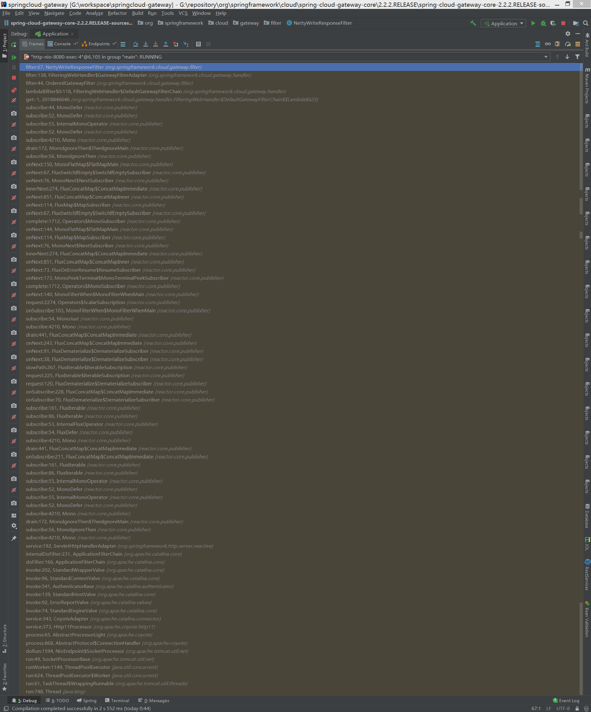
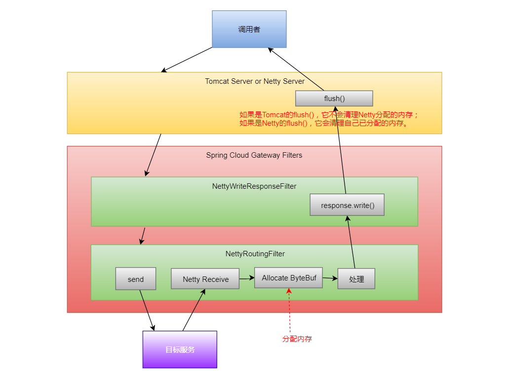

## Tomcat与Netty是如何衔接起来的？

请看下面这张图：



从下往下看，接收请求的时候走的确实是tomcat，然后通过spring cloud gateway的过滤器链，走到了一个叫作`NettyWriteResponseFilter`的过滤器。

再接着往下走，又走到了一个叫作`NettyRoutingFilter`的一个过滤器，这个过滤器是干什么的呢？

从名字可以看出，它是用来做路由的，也就是在这里把gateway接收到的请求转发给其它服务。

这里路由的实现其实就是创建一个HttpClient，然后根据配置的路由信息拿到目标地址，然后再向目标服务发送一个Http请求。

我们简单地看一下NettyRoutingFilter里面的实现（跟着我的注释看就好）：

```java
public Mono<Void> filter(ServerWebExchange exchange, GatewayFilterChain chain) {
    // 拿到目标地址，在前面放进去的
    URI requestUrl = exchange.getRequiredAttribute(GATEWAY_REQUEST_URL_ATTR);

    String scheme = requestUrl.getScheme();
    if (isAlreadyRouted(exchange)
            || (!"http".equals(scheme) && !"https".equals(scheme))) {
        return chain.filter(exchange);
    }
    setAlreadyRouted(exchange);

    // 原始请求
    ServerHttpRequest request = exchange.getRequest();

    final HttpMethod method = HttpMethod.valueOf(request.getMethodValue());
    final String url = requestUrl.toASCIIString();

    HttpHeaders filtered = filterRequest(getHeadersFilters(), exchange);

    // 构造新的请求头
    final DefaultHttpHeaders httpHeaders = new DefaultHttpHeaders();
    filtered.forEach(httpHeaders::set);

    boolean preserveHost = exchange
            .getAttributeOrDefault(PRESERVE_HOST_HEADER_ATTRIBUTE, false);
    Route route = exchange.getAttribute(GATEWAY_ROUTE_ATTR);

    // 获取一个HttpClient
    // key1, 此时还在tomcat的线程里
    Flux<HttpClientResponse> responseFlux = getHttpClient(route, exchange)
            // 设置请求头
            .headers(headers -> {
                headers.add(httpHeaders);
                // Will either be set below, or later by Netty
                headers.remove(HttpHeaders.HOST);
                if (preserveHost) {
                    String host = request.getHeaders().getFirst(HttpHeaders.HOST);
                    headers.add(HttpHeaders.HOST, host);
                }
            // 发送请求
            }).request(method).uri(url).send((req, nettyOutbound) -> {
                if (log.isTraceEnabled()) {
                    nettyOutbound
                            .withConnection(connection -> log.trace("outbound route: "
                                    + connection.channel().id().asShortText()
                                    + ", inbound: " + exchange.getLogPrefix()));
                }
                // 发送请求
                // key2，此时已经到netty的线程里了
                return nettyOutbound.send(request.getBody().map(this::getByteBuf));
            }).responseConnection((res, connection) -> {
                // response的处理

                // Defer committing the response until all route filters have run
                // Put client response as ServerWebExchange attribute and write
                // response later NettyWriteResponseFilter
                exchange.getAttributes().put(CLIENT_RESPONSE_ATTR, res);
                exchange.getAttributes().put(CLIENT_RESPONSE_CONN_ATTR, connection);

                ServerHttpResponse response = exchange.getResponse();
                // put headers and status so filters can modify the response
                HttpHeaders headers = new HttpHeaders();

                res.responseHeaders().forEach(
                        entry -> headers.add(entry.getKey(), entry.getValue()));

                String contentTypeValue = headers.getFirst(HttpHeaders.CONTENT_TYPE);
                if (StringUtils.hasLength(contentTypeValue)) {
                    exchange.getAttributes().put(ORIGINAL_RESPONSE_CONTENT_TYPE_ATTR,
                            contentTypeValue);
                }

                setResponseStatus(res, response);

                // make sure headers filters run after setting status so it is
                // available in response
                HttpHeaders filteredResponseHeaders = HttpHeadersFilter.filter(
                        getHeadersFilters(), headers, exchange, Type.RESPONSE);

                if (!filteredResponseHeaders
                        .containsKey(HttpHeaders.TRANSFER_ENCODING)
                        && filteredResponseHeaders
                                .containsKey(HttpHeaders.CONTENT_LENGTH)) {
                    // It is not valid to have both the transfer-encoding header and
                    // the content-length header.
                    // Remove the transfer-encoding header in the response if the
                    // content-length header is present.
                    response.getHeaders().remove(HttpHeaders.TRANSFER_ENCODING);
                }

                exchange.getAttributes().put(CLIENT_RESPONSE_HEADER_NAMES,
                        filteredResponseHeaders.keySet());

                response.getHeaders().putAll(filteredResponseHeaders);

                return Mono.just(res);
            });

    Duration responseTimeout = getResponseTimeout(route);
    if (responseTimeout != null) {
        responseFlux = responseFlux
                .timeout(responseTimeout, Mono.error(new TimeoutException(
                        "Response took longer than timeout: " + responseTimeout)))
                .onErrorMap(TimeoutException.class,
                        th -> new ResponseStatusException(HttpStatus.GATEWAY_TIMEOUT,
                                th.getMessage(), th));
    }

    // 过滤器链
    return responseFlux.then(chain.filter(exchange));
}
```

忽略代码本身的复杂性，整体逻辑就是向目标服务发送请求，并处理响应体。

但是，这里真正发请求的时候是在Netty线程里发送的，所以处理响应体也同样是在Netty线程中进行的。

而在处理响应之前呢，当然是收到目标服务的响应，在接收目标服务的响应的时候就是在Netty的NioEventLoop中进行的，Netty接收到响应后会创建一个ByteBuf来承载响应的内容，最后，经过一系列的调用就回到了NettyWriteResponseFilter的回调里，在NettyWriteResponseFilter里对响应体进行写出操作，让我们看一下这个类里面的基本内容：

```java
public Mono<Void> filter(ServerWebExchange exchange, GatewayFilterChain chain) {
    // NOTICE: nothing in "pre" filter stage as CLIENT_RESPONSE_CONN_ATTR is not added
    // until the NettyRoutingFilter is run
    // @formatter:off
    return chain.filter(exchange)
            .doOnError(throwable -> cleanup(exchange))
            .then(Mono.defer(() -> {
                // 响应的回调
                
                Connection connection = exchange.getAttribute(CLIENT_RESPONSE_CONN_ATTR);

                if (connection == null) {
                    return Mono.empty();
                }
                if (log.isTraceEnabled()) {
                    log.trace("NettyWriteResponseFilter start inbound: "
                            + connection.channel().id().asShortText() + ", outbound: "
                            + exchange.getLogPrefix());
                }
                // 响应
                ServerHttpResponse response = exchange.getResponse();

                // TODO: needed?
                final Flux<DataBuffer> body = connection
                        .inbound()
                        .receive()
                        .retain()
                        .map(byteBuf -> wrap(byteBuf, response));

                MediaType contentType = null;
                try {
                    contentType = response.getHeaders().getContentType();
                }
                catch (Exception e) {
                    if (log.isTraceEnabled()) {
                        log.trace("invalid media type", e);
                    }
                }
                
                // 写出
                return (isStreamingMediaType(contentType)
                        ? response.writeAndFlushWith(body.map(Flux::just))
                        : response.writeWith(body));
            })).doOnCancel(() -> cleanup(exchange));
    // @formatter:on
}
```

但是，这里的response是TomcatServerHttpResponse，因为接收请求是通过tomcat接收的，所以，这里的响应是tomcat的。

因此，最后是调用了tomcat的write()方法或者writeAndFlush()方法，此时，已经没有Netty什么事了。

在整个过程中，接收目标服务的响应的时候通过Netty分配了ByteBuf而把这个响应返回给调用者的时候却是走的tomcat，导致这个分配的ByteBuf一直没有释放，所以，出现了内存泄漏。

如果全程都使用Netty的情况下，也会经历上面说到的这些步骤，只不过在最后这里的响应会变成ReactorServerHttpResponse，而不是tomcat的响应。

在ReactorServerHttpResponse里面就会调用到Netty的相关方法，并往Netty的线程池里放一个任务，这个任务是reactor.netty.channel.MonoSendMany.SendManyInner.AsyncFlush：

```java
final class AsyncFlush implements Runnable {
    @Override
    public void run() {
        if (pending != 0) {
            ctx.flush();
        }
    }
}
```

在这个任务里面调用ctx.flush()，这个flush()就是把内容真正地发送出去的方法，发送完了之后，也会把相应的ByteBuf给清理了，也就释放了内存。

好了，让我们用一张图来表示一下整个的过程：




